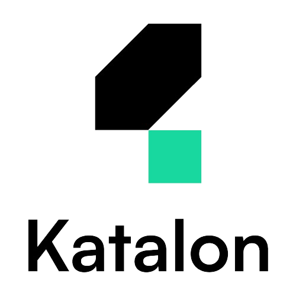

<h1 align="center" style="display: flex; align-items: center;">
    Hi,I'm Bhavin Thumar
</h1>


- 🔭 I’m currently working on UI testing **NodeJs with Playwright & NodeJs with Selenium.**

- 🌱 Also I'm currently working on API testing(API automation) using **Java with Playwright.**

- 👯 I’m looking to collaborate on **API Automation Testing, UI Testing.**

- 👨‍💻 All of my projects are available at [GitHub](https://github.com/bh-bts)

- 💬 Having a Knowledge of API testing using Playwright, and Web app automation testing using Selenium.

- 📄 Know about my experiences in [Linkedin](https://www.linkedin.com/in/bhavin-thumar-633197217/)

<h2 >
    A little more about me...
</h2>

``` cpp
// SPDX-License-Identifier: MIT
pragma solidity ^0.8.15;

contract Profile {
    string public name = "Bhavin Thumar";
    string public pronouns = "He | Him | His";
    string public currentFocus = "Automation Testing";

    string[] internal programmingSkills;
    string[] internal automationTestingTools;
    string[] internal testingFrameworks;


constructor() {
        programmingSkills = [
            "Java", 
            "JavaScript",
            "Python"
        ];
        automationTestingTools = [
            "Selenium",
            "Playwright",
            "Rest-Assured",
            "Appium",
            "Percy"
        ];
        testingFrameworks = [
            "TestNG",
            "Pytest"
        ];
    }

    function getSkills() public view returns (string[] memory, string[] memory, string[] memory) {
        return (programmingSkills, automationTestingTools, testingFrameworks);
    }

    function fun() public view returns (string memory) {
        return "In the world of automation testing, bugs aren't feared they're expected guests, welcomed with open arms by our code!";
    }

    function contactMe() public pure returns (String memory){
        string memory email = "thumarbhavin.786@gmail.com";

        return string(abi.encodePacked("Feel free to reach out to me via email at ", email));
    }
}
```

## Find Automation Testing Project for Your Practice
1. Java-Selenium-TestNG for UI Testing
2. Java-RestAssured-Testng for API Testing
3. Java-Playwright for UI Testing
4. Java-Playwright for API Testing
5. Java-Selenium-TestNG-Percy for Visual Testing
6. NodeJs-Playwright for UI Testing
7. NodeJs-Selenium-Percy for Visual Testing

## Find AI Automation Testing Project
1. Java-Selenium-Stanford CoreNLP for sentiment analysis
2. Java-Selenium-Healenium for Self-healing locators.
3. NodeJs-Playwright-Auto Playwright for UI Automation using prompt


<h3 align="left">Connect with me:</h3>
<p align="left">
<a href="https://twitter.com/BhavinThumar14" target="blank"></a>
<a href="https://www.linkedin.com/in/bhavin-thumar" target="blank"></a>
<a href="https://www.facebook.com/bhavin.thumar.750/" target="blank"></a>
<a href="https://www.instagram.com/bhavin_thumar__bts/" target="blank"></a>
<a href="https://devstory.fyi/bhavin-thumar" target="blank"></a>
<a href="https://medium.com/@bhavin_thumar" target="blank"></a>
<a href="https://substack.com/@bhavinthumar" target="blank"></a>
</p>

<h3 align="left">Languages and Tools:</h3>
<p align="left"> 
<a href="https://www.selenium.dev" target="_blank">  </a>
<a href="https://playwright.dev/java/" target="_blank">  </a>
<a href="https://git-scm.com/" target="_blank">  </a> 
<a href="https://www.java.com" target="_blank">  </a> 
<a href="https://developer.mozilla.org/en-US/docs/Web/JavaScript" target="_blank">  </a> 
<a href="https://www.jenkins.io" target="_blank">  </a> 
<a href="https://ant.apache.org/bindownload.cgi" target="_blank">  </a> 
<a href="https://karatelabs.github.io/karate/karate-core/" target="_blank">  </a> 
<a href="https://katalon.com/" target="_blank">  </a> 

</p>


<!-- BLOG-POST-LIST:START -->
<!-- BLOG-POST-LIST:END -->
